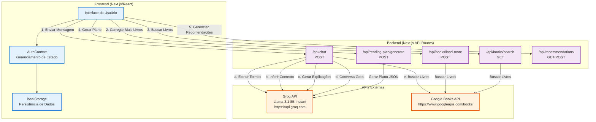

# Diagrama de Fluxo - Sistema de Recomendação de Livros

## Diagrama Principal

```mermaid
flowchart TD
    Start([Usuário Acessa Aplicação]) --> CheckAuth{Usuário<br/>Autenticado?}
    
    CheckAuth -->|Não| LoginPage[Tela de Login]
    LoginPage --> CheckEmail{Email já<br/>registrado?}
    CheckEmail -->|Sim| LoginSuccess[Login Bem-sucedido<br/>Carrega dados do localStorage]
    CheckEmail -->|Não| RegisterPage[Tela de Registro]
    RegisterPage --> CreateUser[Criar Novo Usuário<br/>Salvar no localStorage]
    CreateUser --> LoginSuccess
    
    LoginSuccess --> CheckOnboarding{Onboarding<br/>Completo?}
    
    CheckOnboarding -->|Não| OnboardingFlow[Fluxo de Onboarding]
    OnboardingFlow --> Step1[1. Selecionar Interesses<br/>Gêneros literários]
    Step1 --> Step2[2. Definir Tempo de Leitura<br/>Minutos por dia]
    Step2 --> Step3[3. Escolher Nível<br/>Iniciante/Intermediário/Avançado]
    Step3 --> SaveOnboarding[Salvar Dados de Onboarding<br/>localStorage]
    SaveOnboarding --> HomeScreen
    
    CheckOnboarding -->|Sim| HomeScreen[Tela Inicial]
    
    HomeScreen --> UserAction{Usuário Escolhe}
    
    UserAction -->|Chat| ChatPage[Tela de Chat]
    UserAction -->|Recomendações| RecommendationsPage[Página de Recomendações]
    UserAction -->|Plano de Leitura| ReadingPlanPage[Página de Plano de Leitura]
    UserAction -->|Perfil| ProfilePage[Página de Perfil]
    
    %% Fluxo do Chat
    ChatPage --> ChatInit[Inicializar Chat<br/>Mensagem de Boas-vindas]
    ChatInit --> UserMessage[Usuário Digita Mensagem]
    UserMessage --> SendToAPI[POST /api/chat<br/>Enviar mensagem + onboarding]
    
    SendToAPI --> DetectIntent{Detectar Intenção<br/>de Busca?}
    
    DetectIntent -->|Sim| CheckGeneric{Busca<br/>Genérica?}
    DetectIntent -->|Não| CheckAmbiguous{Mensagem<br/>Ambígua?}
    
    CheckGeneric -->|Sim| UseOnboarding[Usar Interesses<br/>do Onboarding]
    CheckGeneric -->|Não| ExtractTerms[Extrair Termos<br/>com Groq API]
    
    CheckAmbiguous -->|Sim| InferContext[Inferir Contexto<br/>Groq API]
    InferContext --> ShowConfirmation[Mostrar Confirmação<br/>Você gostaria de livros sobre X?]
    ShowConfirmation --> UserConfirm{Usuário<br/>Confirma?}
    UserConfirm -->|Sim| ExtractTerms
    UserConfirm -->|Não| ResetChat[Resetar Chat<br/>Mostrar Botão Recomendar]
    ResetChat --> ChatInit
    
    UseOnboarding --> SearchGoogleBooks[Buscar na<br/>Google Books API]
    ExtractTerms --> SearchGoogleBooks
    
    SearchGoogleBooks --> FilterResults[Filtrar Resultados<br/>Excluir já recomendados<br/>Excluir em planos de leitura]
    FilterResults --> GenerateReasons[Gerar Explicações<br/>Personalizadas<br/>Groq API para cada livro]
    GenerateReasons --> ReturnBooks[Retornar Cards<br/>de Livros]
    
    DetectIntent -->|Não| GeneralChat[Conversa Geral<br/>Groq API]
    GeneralChat --> ReturnText[Retornar Resposta<br/>Textual]
    
    ReturnBooks --> DisplayBooks[Exibir Cards<br/>de Livros no Chat]
    ReturnText --> DisplayText[Exibir Mensagem<br/>do Assistente]
    
    DisplayBooks --> UserBookAction{Ação do<br/>Usuário}
    UserBookAction -->|Adicionar Recomendação| AddToRecommendations[Adicionar às<br/>Recomendações<br/>localStorage]
    UserBookAction -->|Favoritar| AddToFavorites[Adicionar aos<br/>Favoritos<br/>localStorage]
    UserBookAction -->|Criar Plano| GeneratePlan[Gerar Plano<br/>de Leitura]
    UserBookAction -->|Carregar Mais| LoadMore[POST /api/books/load-more<br/>Buscar mais livros]
    
    LoadMore --> SearchGoogleBooks
    
    %% Fluxo de Geração de Plano
    GeneratePlan --> PlanAPI[POST /api/reading-plan/generate<br/>Enviar: livro, páginas, tempo]
    PlanAPI --> PlanGroq[Groq API<br/>Gerar Plano Estruturado JSON]
    PlanGroq --> PlanResponse[Retornar Plano<br/>com etapas diárias]
    PlanResponse --> SavePlan[Salvar Plano<br/>localStorage]
    SavePlan --> ReadingPlanPage
    
    %% Fluxo de Recomendações
    RecommendationsPage --> ShowRecommendations[Exibir Livros<br/>Recomendados]
    ShowRecommendations --> RecAction{Ação do<br/>Usuário}
    RecAction -->|Remover| RemoveRec[Remover Recomendação<br/>Verificar se está em Favoritos<br/>Remover também se favoritado]
    RecAction -->|Favoritar| AddToFavorites
    RecAction -->|Ver Detalhes| BookDetailPage[Página de Detalhes<br/>do Livro]
    
    RemoveRec --> UpdateLocalStorage[Atualizar localStorage]
    AddToFavorites --> UpdateLocalStorage
    
    %% Estilos
    classDef apiCall fill:#e1f5ff,stroke:#01579b,stroke-width:2px
    classDef externalAPI fill:#fff3e0,stroke:#e65100,stroke-width:2px
    classDef storage fill:#f3e5f5,stroke:#4a148c,stroke-width:2px
    classDef decision fill:#fff9c4,stroke:#f57f17,stroke-width:2px
    classDef process fill:#e8f5e9,stroke:#1b5e20,stroke-width:2px
    
    class SendToAPI,PlanAPI,LoadMore apiCall
    class SearchGoogleBooks,ExtractTerms,InferContext,GenerateReasons,GeneralChat,PlanGroq externalAPI
    class SaveOnboarding,AddToRecommendations,AddToFavorites,SavePlan,UpdateLocalStorage,CreateUser storage
    class CheckAuth,CheckOnboarding,CheckEmail,DetectIntent,CheckGeneric,CheckAmbiguous,UserConfirm,UserAction,UserBookAction,RecAction decision
    class ChatPage,HomeScreen,RecommendationsPage,ReadingPlanPage,ProfilePage,OnboardingFlow process
```

## Diagrama de Fluxo Detalhado - Processamento de Mensagem no Chat

```mermaid
flowchart TD
    Start([Mensagem do Usuário]) --> Validate{Validar<br/>Mensagem}
    Validate -->|Vazia| End1([Fim])
    Validate -->|Válida| CheckPattern{Padrão<br/>Simples?}
    
    CheckPattern -->|Recomendar um livro| GenericSearch[Busca Genérica<br/>Usar Interesses do Onboarding]
    CheckPattern -->|Não| CheckKeywords{Contém<br/>Palavras-chave<br/>de Busca?}
    
    CheckKeywords -->|Sim| CheckDirect{É busca<br/>direta após<br/>confirmação?}
    CheckKeywords -->|Não| CheckHasBook{Contém<br/>palavra<br/>livros?}
    
    CheckDirect -->|Sim| DirectSearch[Busca Direta<br/>Extrair termos]
    CheckDirect -->|Não| CheckAmbiguous2{É<br/>Ambígua?}
    
    CheckHasBook -->|Sim| CheckAmbiguous2
    CheckHasBook -->|Não| GeneralConversation[Conversa Geral<br/>Groq API]
    
    CheckAmbiguous2 -->|Sim| InferTopic[Inferir Tema<br/>Groq API]
    InferTopic --> ShowConfirm[Mostrar: Você gostaria<br/>de livros sobre X?]
    ShowConfirm --> WaitUser{Usuário<br/>Responde}
    WaitUser -->|Sim| DirectSearch
    WaitUser -->|Não| Reset[Resetar Chat]
    
    CheckAmbiguous2 -->|Não| GeneralConversation
    
    GenericSearch --> ExtractOnboarding[Combinar Interesses<br/>com OR]
    DirectSearch --> ExtractWithAI[Extrair Termos<br/>Groq API]
    
    ExtractOnboarding --> SearchGB[Google Books API<br/>Buscar Livros]
    ExtractWithAI --> ValidateTerms{Termos<br/>Válidos?}
    
    ValidateTerms -->|Inválidos| FilterInvalid[Filtrar Termos<br/>Inválidos]
    FilterInvalid --> ValidateTerms
    ValidateTerms -->|Válidos| SearchGB
    
    SearchGB --> TransformResults[Transformar Resultados<br/>Formato da Aplicação]
    TransformResults --> FilterDuplicates[Filtrar Duplicatas<br/>Já recomendados<br/>Em planos de leitura]
    
    FilterDuplicates --> CheckCount{Quantidade<br/>Suficiente?}
    CheckCount -->|Não| LoadMoreGB[Carregar Mais<br/>Google Books API]
    LoadMoreGB --> FilterDuplicates
    
    CheckCount -->|Sim| GenerateReasons[Para Cada Livro:<br/>Gerar Explicação<br/>Groq API]
    GenerateReasons --> ReturnResponse[Retornar Resposta<br/>com Livros]
    
    GeneralConversation --> ReturnText[Retornar Resposta<br/>Textual]
    
    ReturnResponse --> Display[Exibir Cards<br/>de Livros]
    ReturnText --> DisplayText[Exibir Mensagem]
    
    Display --> End2([Fim])
    DisplayText --> End2
    Reset --> End2
    
    classDef apiCall fill:#e1f5ff,stroke:#01579b,stroke-width:2px
    classDef externalAPI fill:#fff3e0,stroke:#e65100,stroke-width:2px
    classDef decision fill:#fff9c4,stroke:#f57f17,stroke-width:2px
    classDef process fill:#e8f5e9,stroke:#1b5e20,stroke-width:2px
    
    class ExtractWithAI,InferTopic,GenerateReasons,GeneralConversation externalAPI
    class SearchGB,LoadMoreGB externalAPI
    class Validate,CheckPattern,CheckKeywords,CheckDirect,CheckHasBook,CheckAmbiguous2,WaitUser,ValidateTerms,CheckCount decision
    class GenericSearch,DirectSearch,ExtractOnboarding,TransformResults,FilterDuplicates,ReturnResponse,ReturnText process
```

## Diagrama de Arquitetura - APIs e Integrações

## Legenda

- **Retângulos Arredondados**: Início/Fim de processos
- **Losangos**: Decisões/Condicionais
- **Retângulos**: Processos/Ações
- **Cores**:
  - **Azul Claro**: Chamadas de API internas
  - **Laranja**: APIs externas (Groq, Google Books)
  - **Roxo**: Operações de armazenamento (localStorage)
  - **Amarelo**: Pontos de decisão
  - **Verde**: Processos principais

